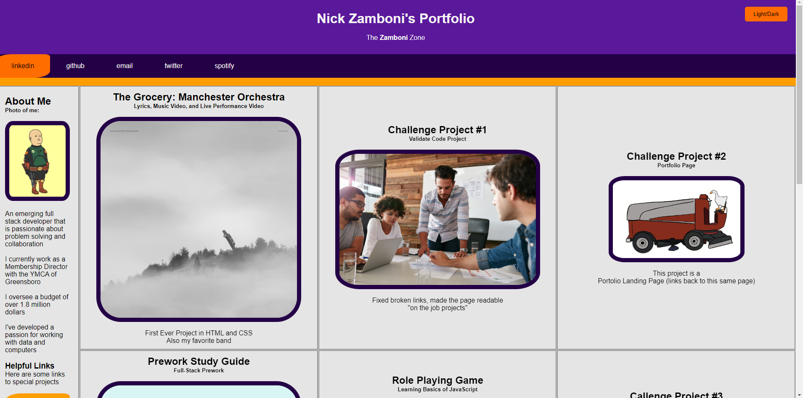

# Nick Zamboni's Portfolio

Live Site: https://ndzamboni.github.io/portfolio-landing-page/

The purpose of this is to create a professional landing page that displays the entire spectrum of full-stack web development projects.

## Landing Page

* The landing page should show a breif overview of Nick's bio.
* The landing page will have clickable tiles or buttons that pull up works completed.
* The landing page will have links to relavent social media, github, email, and linkedin.
* The landing page will have hover effects to improved readability. 
* Continue to build on this idea

## Acceptance Critera

* It is done when, landing page shows overview of work history
* It is done when, landing page shows overview of social media
* It is done when, landing page shows overview of projects completed
* It is done when, lading page shows overview of useful links and cheatsheets
* It is done when, all links work as intended
* It is done when, page is responsive

## Notes/Future Ideas

* Landing page should have animated or some sort of intermediate or advanced javascript elements
* Landing page should link to all other projects done within and outside of coding instruction
* Landing page should link to at least one fun project
* Landing page should (at some point) be connected to subjects such as SQL, Power BI, Python, C#, etc.
* Landing page will have clickable tiles or buttons that pull up works completed like "education", "work history", "notable accomplishments", etc.

* More to come...
